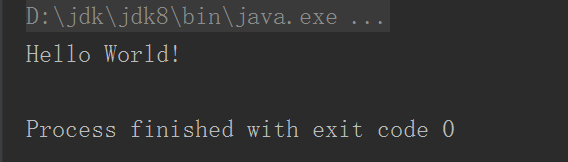

# 2.一切都是对象
## 2.1 用引用操纵对象
每种编程语言都有自己的操纵内存中元素的方式。在Java中尽管一切视为对象，但是本质上是对象上的一个引用。  
当拥有引用时，不一定需要跟对象关联：
```java
 String s;
``` 
 此时只是创建引用而不是对象，因此一种安全的做法是：创建一个引用的同时便进行初始化。  
```java  
 String s="abcd";
  ```
## 2.2 必须由你创建的对象
一旦创建一个引用，就希望它能与一个新的对象相关关联。通常通过new操作符来实现这一个目的。new关键字的意思就是给我一个新的对象。
### 2.2.1 储存到什么地方
  1）**寄存器**。这个是最快的存储区。  
  2）**栈堆**。  位于RAM(随机访问存储器)创建程序时，Java系统必须知道存储在堆栈内所有项确切的生命周期。
  Java引用存储在其中，但是Java对象不存在其中。  
  3）**常量存储**。常量值通常存在程序代码的内部，这样做是安全的，因为它们永远不会改变。  
  4）**非RAM存储**。把对象装换成可以存放在其他媒介上的食物。  
### 2.2.2 特例：基本类型
在Java中，基本类型不是创建的变量并非对象，不能通过new来创建，直接赋值即可，基本类型创建的变量存在堆栈中，因此更加高效。  
基本类型对应的参数：  

| 基本类型  |大小|最小值|最大值|包装器类型|
|---|---|---|---|---|
|  **boolean** | -  | -  | -  | **Boolean** |
|  **char** |  16-bit | Unicode 0| Unicode 2^16-1  |**Character**   |
| **byte**  |8 bit   | -128  | +127  |**Byte**   |
|  **short** | 16bit  |  -2^15 |+2^15-1   |**Short**   |
|  **int** | 32bit  |-2^31   |+2^31-1   |**Interger**   |
| **long**  |64bit   |-2^63   |2^63-1   |**Long**  |
|  **float** |32bit   |IEEE754   |  IEEE754  |   **Float**|
|   **double**|64bit   |IEEE754    | IEEE754   |**Double**   |
| **void** | -  |  - |  - |**Void**   |
### 2.2.3 Java中的数组
在Java中，数组会确保会被初始化，而且不能在它的范围之外被访问。
当创建一个数组对象时，实际上就是创建一个引用数组，并且每个引用都会自动初始化为一个特定值，该值拥有自己的关键字null。
同样创建存放基本数据类型的数组，编译器也能确保这种初始化，因为它会将这种数组所占的内存全部清零。
## 2.3 永远不要销毁对象
### 2.3.1 作用域
作用域决定了在其内定义的变量名的可见性和周期性。
```java
{
    int x=12;//只有x有效
    {
        int q=96;//x和q都有效
        
    }
    //只有x有效
    //q在此失去作用域
}
```
### 2.3.2 对象的作用域
Java对象不具备和基本类型一样的生命周期，当new创建一个对象时，它可以存活于作用域之外。  
```java
  {
            String s=new String ("a String");
  }//作用域消失的点
```
引用s在作用域终点就消失了。然而s指向的String对象还继续占据内存空间。
在处理垃圾内存这块，Java有一个垃圾回收器，用来监视用new创建的对象，并辨别出
那些不会再引用的对象，随后释放这些对象的内存空间，以便提供其他新的对象。
## 2.4 创建新的数据类型：类
Java在设计时使用了关键字：class。  
### 2.4.1
一旦定义了一个类，就可以在类中设置两种类型的元素：**字段**和**方法**。  
**基本数据的默认值**：  


| 基本数据类型| 默认值 |
|---|---|
|  boolean|false  |
|  char|'\u0000'(null)  |
|  byte|(byte)0  |
|  short|(short)0  |
|  int|0  |
|  long|0L  |
| float |0.0f  |
|  double|0.0d  |
上述初始化的方法不适用于**局部变量**。**局部变量**不能自动设置默认值，需要手动设置。
## 2.5 方法、参数和返回值
Java的方法决定了一个对象能够接收什么样的消息。方法的基本组成部分包括：名称、参数、返回值和方法体。  
基本的形式：
```java
   ReturnType methodName(/*参数列表*/){
    /*方法体*/
}
```
### 2.5.1 参数列表
方法的参数列表指定要传递给方法什么样的消息。
## 2.6 创建一个Java程序
### 2.6.1 名字可见性
在Java中使用包的概念来管理源代码，使源代码具有唯一标识。
### 2.6.2 运用其他构件
使用import关键字使自己的程序更加丰富。
### 2.6.3 static关键字
通过static 关键字可以满足这两个方面的需求，当声明一个事物是static时，就以为这个域或方法不会与包含它的那个类的任何对象
实例关联在一起。所以可以从未创建某个类的任何对象，也可以调用static方法。  
引用static变量有两种方法。**1.通过一个对象实例去定位它**。**2.通过类名直接引用**。
## 2.7 我的第一个Java程序
```java
public class HelloWorld {
    public static void main(String[] args) {
        System.out.println("Hello World!");
    }
}
```
### 2.7.1 编译和运行
在安装好JDK后，设置好环境变量后，使用两个命令：  
1.javac HelloWorld.java  
2.java HelloWorld  
输出结果：  
 
## 2.8 注释和嵌入式文档
### 2.8.1 注释文档
javadoc是提取java注释的工具，它是jdk的一部分。
### 2.8.2 语法
所有的javadoc只能在“/**”注释中出现，和通常一样，注释结束于“*/”。
使用就javadoc的方式主要有两种：嵌入HTML，或者使用文档标签。
### 2.8.3 嵌入式HTML 
详细参考HTML
### 一些标签示例
#### 1.@see:引用其他类
@see标签允许用户引用其他类的文档。javadoc会在其生成的HTML文件中，通过
@see标签可以连接到其他文档中。格式如下：
```java
    @see classname
    @see full-qualified-classname
    @see full-qualified-classname#method-name
```
#### 2.{@link package.class#member label}
该标签与@see极其相似，只是它作用于行内。
#### 3.{@docRoot}
该标签产生到文档根目录的相对路径，用于文档树的显式链接。
#### 4.{@inheritDoc}
该标签从当前这个类的最直接的基类中继承相关文档到当前的文档注释中。
#### 5.{@version}
格式如下：
```java
    @version 版本信息
``` 
#### 6.@author
格式如下：
```java
    @author 作者信息
```
#### 7.@since
该标签允许你指定程序代码最早使用的版本。
#### 8.@param
该表用于方法文档中，形式如下：
```java
    @param 参数描述
```
#### 9.@return
该表用于方法文档中，形式如下：
```java
    @return 返回参数描述
```
#### 10.throws
它们是某个方法调用失败而抛出的对象。
#### 11.deprecated
该表用于指出一些旧特性已由改进的新特性所取代，建议用户不要用该特性。
